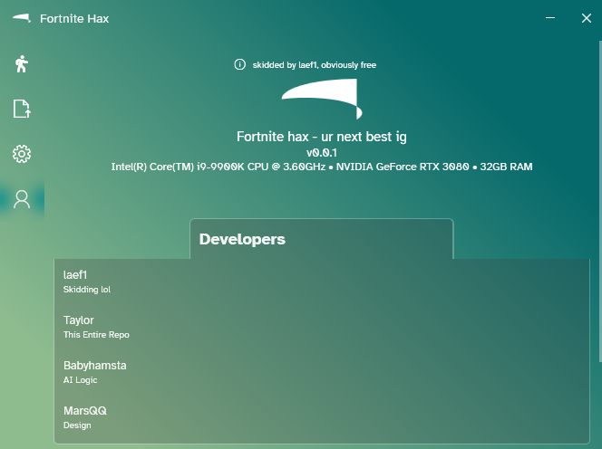

# FortniteHax

FortniteHax is an FPS-optimized fork of Aimmy designed specifically for Fortnite. This fork focuses on performance and precision by incorporating features like Aim Strength adjustment and the stealth SendInput mouse input method. It aims to provide a smooth and undetectable aimbot experience tailored for Fortnite enthusiasts.

---

## Features

### Advanced YOLOv8 Integration
- Uses YOLOv8 for highly accurate object detection and tracking.
- Optimized model support for better FPS performance in Fortnite.

### Smooth and Intuitive UI
- A modern, easy-to-navigate interface for seamless configuration.
- Responsive sliders, toggles, and dropdowns for precise customization.

### Aim Assist
- **Aim Assist Toggle**: Enable or disable aim assist.
- **Aim Keybind**: Assign a key for aim activation (default: Right).
- **Aim Strength**: Adjust the aim assist strength (default: 3.70).
- **Second Aim Keybind**: Assign an optional secondary keybind (default: G).
- **Constant AI Tracking**: Toggle AI tracking for continuous aim.
- **Emergency Stop Keybind**: Assign a key for emergency stop (default: Right Bracket).

### Aim Config
- **Prediction Method**: Choose prediction methods (e.g., `wisethefox's EMA Prediction`).
- **Detection Area Type**: Select detection area (e.g., Closest to Center Screen).
- **Aiming Boundaries Alignment**: Set aiming alignment (e.g., Center).
- **Mouse Sensitivity**: Fine-tune mouse sensitivity (default: 0.83).
- **Mouse Jitter**: Add jitter to mouse input (default: 0.00).
- **X Offset (Left/Right)**: Adjust horizontal aim offset (default: -5.00).
- **Y Offset (Up/Down)**: Adjust vertical aim offset (default: -4.00).
- **AI Minimum Confidence**: Set the AI confidence threshold for detection (default: 9.00%).

### Auto Trigger
- Toggle and configure auto-trigger functionality.

### Anti Recoil
- Enable and adjust anti-recoil settings.

### ESP Config
- **Show Detected Player**: Toggle the display of detected players.
- **Show AI Confidence**: Enable AI confidence display.
- **Show Tracers**: Enable visual tracers.

### Flexible Input and Execution Options
- Multiple mouse input methods:
  - **SendInput**: Standard mouse input.
  - **SendInput Stealth**: Optimized for stealth operation.
  - **Mouse Event**: Uses Windows Mouse Event API.
- Execution types:
  - **CUDA**: Best performance for systems with NVIDIA GPUs.
  - **TensorRT**: High-performance inference for supported GPUs.
  - **CPU**: Last-resort option for systems without GPU support.

### Screen Capture Modes
- **DirectX**: Recommended for best compatibility and performance.
- **GDI**: Backup method for systems that do not support DirectX.

---

## How to Operate

For detailed instructions, see the [How to Operate Guide](howtooperate_fortnitehax.md).

### Quick Overview:
1. **Run the Program**: Execute `FortniteHax.exe`.
2. **Load the AI Model**: Place your YOLOv8 model in `bin/model` and load it in the program.
3. **Configure Mouse Inputs**: Choose between `SendInput`, `SendInput Stealth`, or `Mouse Event`.
4. **Select Execution Type**: Use `CUDA`, `TensorRT`, or `CPU` based on your system.
5. **Set Screen Capture**: Use `DirectX` or `GDI` based on your system requirements.
6. **Customize ESP and Aim Settings**: Adjust visual configurations and aim parameters for your play style.

---

## Troubleshooting

For detailed solutions, refer to the [Troubleshooting Guide](troubleshoot_fortnitehax.md).

### Common Issues:
- **Infinite Loading**: If stuck while loading a model, switch Execution Type and reboot.
- **Erratic Mouse/Aimbot**: Adjust Mouse Sensitivity and Aim Strength as per the Troubleshooting Guide.

---

## Disclaimer
FortniteHax is intended for private use only. Unauthorized sharing or usage is prohibited. Use this software responsibly and at your own risk.

---
